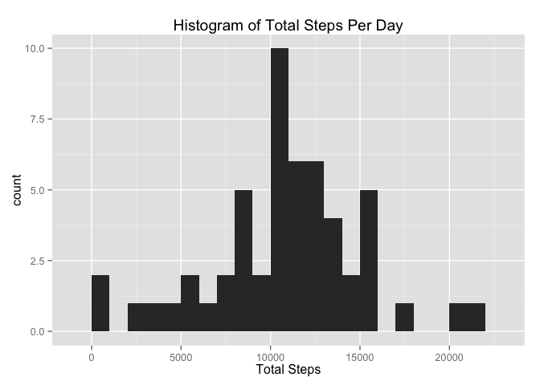
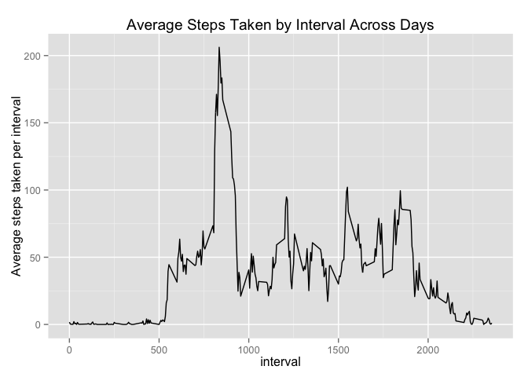
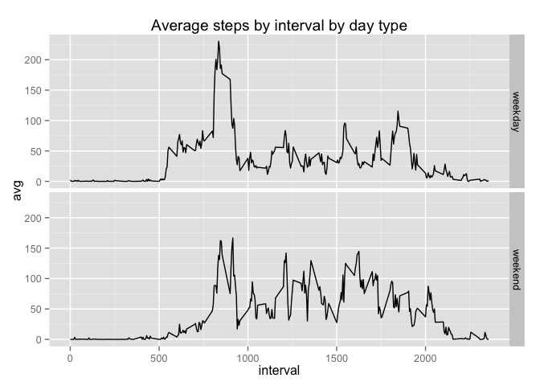

# Reproducible Research: Peer Assessment 1


## Loading and preprocessing the data

```r
library(dplyr)
```

```
## 
## Attaching package: 'dplyr'
## 
## The following object is masked from 'package:stats':
## 
##     filter
## 
## The following objects are masked from 'package:base':
## 
##     intersect, setdiff, setequal, union
```

```r
library(ggplot2)

file <- tbl_df(read.csv("activity.csv"))
file$date <- as.Date(file$date)
```


## What is mean total number of steps taken per day?
The following uses dplyr to shape the data into a data frame
that will omit NA values and group the total number of steps
by the date dimension.

It then uses ggplot2 to plot the data into a histogram that shows
the frequency of total steps. 

Following this last step, it runs the mean and median calculation of total
steps taken.

```r
## Calculate the total number of steps taken per Day
stepsPerDay <- file %>% na.omit %>% group_by(date) %>% summarise(totalSteps=sum(steps))

## Make a Histogram showing total steps per day
histo <- ggplot(stepsPerDay,aes(x=totalSteps)) +
            ggtitle("Histogram of Total Steps Per Day") +
            xlab("Total Steps") +
            geom_histogram(binwidth=1000)
histo
```

 

```r
## Calculate and report the mean and median of the total
## number of steps taken per day
mean(stepsPerDay$totalSteps)
```

```
## [1] 10766.19
```

```r
median(stepsPerDay$totalSteps)
```

```
## [1] 10765
```

## What is the average daily activity pattern?
To answer this question, I first reshaped the data by omitting the NA values,
then select the interval and steps columns, and finally calculate the average
steps taken grouped by the interval count.

I then plotted this data into a line plot and show the average steps taken by interval
across days.

The last step is to calculate the interval with the maximum average step count.


```r
## What is the daily activity pattern? Make a time series

stepsByInterval <- file%>%
    na.omit%>%
    select(c(1, 3))%>%
    group_by(interval)%>%
    summarise(avg=mean(steps))

## Time series plot
ggplot(data=stepsByInterval,
       aes(x=interval,
           y=avg)) +
    ylab("Average steps taken per interval") +
    xlab("interval") +
    geom_line() +
    ggtitle("Average Steps Taken by Interval Across Days")
```

 

```r
## What is the maximum value average across all days in the dataset
max(stepsByInterval$avg)
```

```
## [1] 206.1698
```
## Imputing missing values
To answer this question, I first used the original file and select the first column. I then used is.na to show within
this columns whether a value is NA or not. Following that I created a table to display the total NA values (TRUE)
and the amount that isn't NA (FALSE)

The next part is to devise a strategy, which is: take the average step count by interval and then (already calculated this on the
previous question) and apply the average to all the NA values. To do this, I used an inner join to 
combine the original file with the new file (stepsByInterval). From there, I used ifelse logic to say "if the value in
steps is NA then replace it with the average, if not then leave it". I then converted it to an integer value
grouped the data by date and created a summary table of total steps per day.

Following all of this, I created a histogram -- same that was used in question 1. Then recalculated the mean and median
using the updated data set. There is not a huge difference in the results using the updated data set.

```r
## Input missing values, total number of NAs within the dataset
isNA <- file %>% select(1) %>% is.na %>% table()

## Create a new dataset that is equal to the original but with missing data filled in
## assign the mean of each interval to the missing interval using stepsByInterval
stepsPerDayNA <- inner_join(file, stepsByInterval, by="interval")
stepsPerDayNA <- within(stepsPerDayNA, steps <- ifelse(is.na(steps), avg, steps)) 
stepsPerDayNA <- stepsPerDayNA %>% select(c(1,2,3))
stepsPerDayNA$steps <- as.integer(stepsPerDayNA$steps)
stepsPerDaySum <- stepsPerDayNA %>% group_by(date) %>% summarise(steps=sum(steps))

## Make a Histogram showing total steps per day
histo <- ggplot(stepsPerDaySum,aes(x=steps)) +
    ggtitle("Histogram of Total Steps Per Day") +
    xlab("Total Steps") +
    geom_histogram(binwidth=1000)
histo
```

 

```r
## Calculate and report the mean and median of the total
## number of steps taken per day
mean(stepsPerDaySum$steps)
```

```
## [1] 10749.77
```

```r
median(stepsPerDaySum$steps)
```

```
## [1] 10641
```
## Are there differences in activity patterns between weekdays and weekends?
For the last question, I first used the weekdays function to create a new column that shows 
the day of the week based on the date column. From there, I used ifelse logic to assign
values of either "weekend" or "weekday" to a new column titled dayType.

After this, I then selected the steps, interval, and dayType columns while calculating the average
value of steps by interval and dayType. 

Finally, I then create the facet grid that contains two charts: one with average steps
by weekday and one for weekend.

```r
## Are there differences in activity patterns between weekdays and weekends?
## create new variable indicating weekend or weekday

stepsPerDayNA$day <- weekdays(stepsPerDayNA$date)
stepsPerDayNAdates <- within(stepsPerDayNA, 
                        dayType <- ifelse(
                            stepsPerDayNA$day %in% c("Saturday", "Sunday"), 
                            "weekend", 
                            "weekday"))

stepsPerDayNAdates <- stepsPerDayNAdates%>%
    select(c(1, 3, 5))%>%
    group_by(interval, dayType)%>%
    summarise(avg=mean(steps))

panePlot <- ggplot(stepsPerDayNAdates, aes(interval, avg)) +
            ggtitle("Average steps by interval by day type") +
            facet_grid(dayType ~ .) +
            geom_line()
panePlot
```

 
