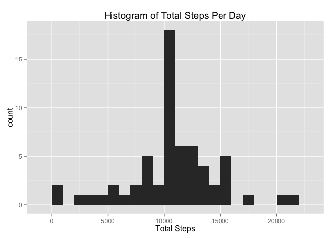

# Reproducible Research: Peer Assessment 1


## Loading and preprocessing the data

```r
library(dplyr)
```

```
## 
## Attaching package: 'dplyr'
## 
## The following object is masked from 'package:stats':
## 
##     filter
## 
## The following objects are masked from 'package:base':
## 
##     intersect, setdiff, setequal, union
```

```r
library(ggplot2)

file <- tbl_df(read.csv("activity.csv"))
file$date <- as.Date(file$date)
```


## What is mean total number of steps taken per day?

```r
## Calculate the mean of steps taken per Day
stepsPerDay <- file %>% na.omit %>% group_by(date) %>% summarise(totalSteps=sum(steps))

## Make a Histogram showing total steps per day
histo <- ggplot(stepsPerDay,aes(x=totalSteps)) +
            ggtitle("Histogram of Total Steps Per Day") +
            xlab("Total Steps") +
            geom_histogram(binwidth=1000)
histo
```

 

```r
## Calculate and report the mean and median of the total
## number of steps taken per day
mean(stepsPerDay$totalSteps)
```

```
## [1] 10766.19
```

```r
median(stepsPerDay$totalSteps)
```

```
## [1] 10765
```

## What is the average daily activity pattern?

```r
## What is the daily activity pattern? Make a time series
stepsByInterval <- select(file, c(1, 3))

stepsByInterval <- file%>%
    na.omit%>%
    select(c(1, 3))%>%
    group_by(interval)%>%
    summarise(avg=mean(steps))

## Time series plot
ggplot(data=stepsByInterval,
       aes(x=interval,
           y=avg)) +
    ylab("Average steps taken per interval") +
    xlab("interval") +
    geom_line() +
    ggtitle("Average Steps Taken by Interval Across Days")
```

 

```r
## What is the maximum value average across all days in the dataset
max(stepsByInterval$avg)
```

```
## [1] 206.1698
```
## Imputing missing values

```r
## Input missing values, total number of NAs within the dataset
isNA <- file %>% select(1) %>% is.na %>% table()

## Create a new dataset that is equal to the original but with missing data filled in
## assign the mean of each interval to the missing interval using stepsByInterval
stepsPerDayNA <- inner_join(file, stepsByInterval, by="interval")
stepsPerDayNA <- within(stepsPerDayNA, steps <- ifelse(is.na(steps), avg, steps)) 
stepsPerDayNA <- stepsPerDayNA %>% select(c(1,2,3))
stepsPerDayNA$steps <- as.integer(stepsPerDayNA$steps)
stepsPerDaySum <- stepsPerDayNA %>% group_by(date) %>% summarise(steps=sum(steps))

## Make a Histogram showing total steps per day
histo <- ggplot(stepsPerDaySum,aes(x=steps)) +
    ggtitle("Histogram of Total Steps Per Day") +
    xlab("Total Steps") +
    geom_histogram(binwidth=1000)
histo
```

 

```r
## Calculate and report the mean and median of the total
## number of steps taken per day
mean(stepsPerDaySum$steps)
```

```
## [1] 10749.77
```

```r
median(stepsPerDaySum$steps)
```

```
## [1] 10641
```
## Are there differences in activity patterns between weekdays and weekends?

```r
## Are there differences in activity patterns between weekdays and weekends?
## create new variable indicating weekend or weekday

stepsPerDayNA$day <- weekdays(stepsPerDayNA$date)
stepsPerDayNAdates <- within(stepsPerDayNA, 
                        dayType <- ifelse(
                            stepsPerDayNA$day %in% c("Saturday", "Sunday"), 
                            "weekend", 
                            "weekday"))

stepsPerDayNAdates <- stepsPerDayNAdates%>%
    select(c(1, 3, 5))%>%
    group_by(interval, dayType)%>%
    summarise(avg=mean(steps))

panePlot <- ggplot(stepsPerDayNAdates, aes(interval, avg)) +
            ggtitle("Average steps by interval by day type") +
            facet_grid(dayType ~ .) +
            geom_line()
panePlot
```

 
